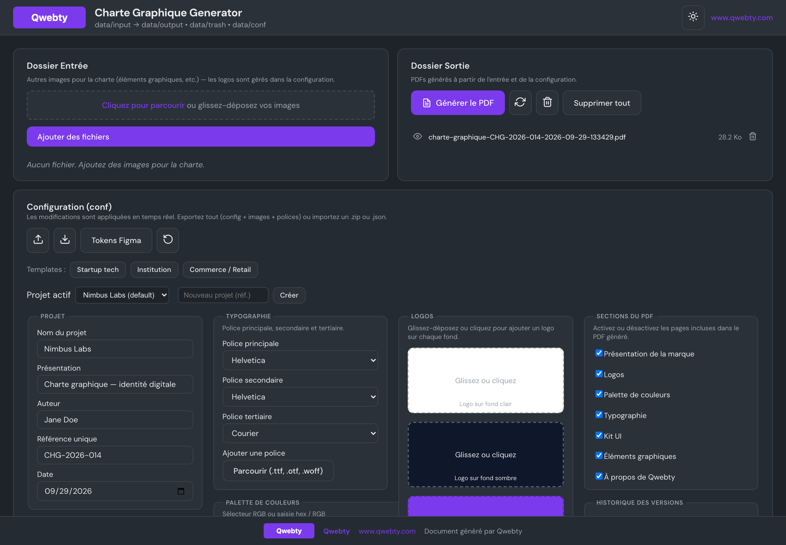
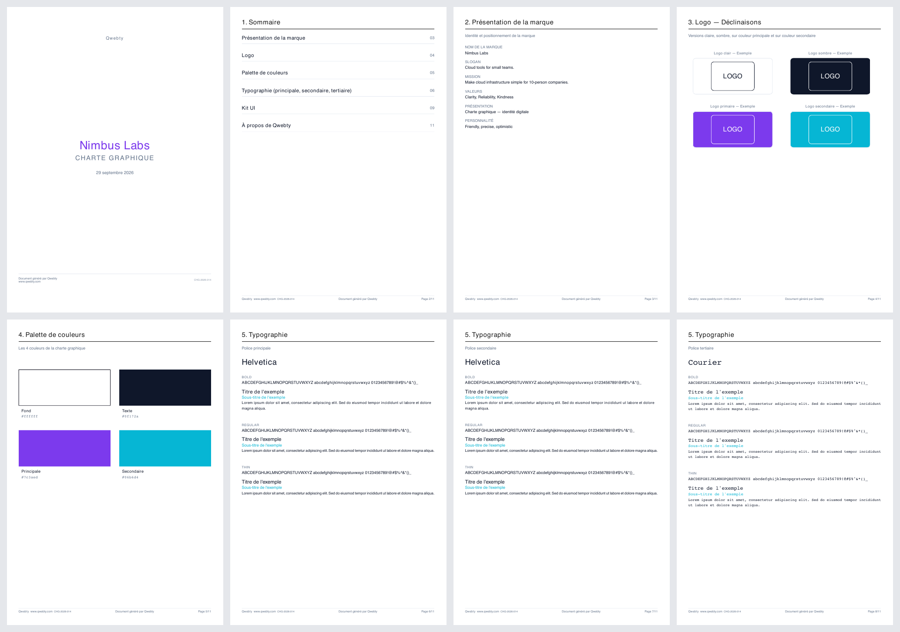

# Charte Graphique Generator

A React + Express web app that produces a complete **brand guidelines PDF** ("charte graphique") from a single configuration screen: logos, colour palette, typography, UI kit and graphic elements. Everything — input, configuration and output — lives on one page, so you can tweak settings and regenerate the PDF without navigating around.

> The UI and the generated documents are in French. PDFs carry a small "Qwebty" footer and an "About" page, which you can disable in the PDF sections panel.

## Screenshots

*Screenshots use a fictional brand ("Nimbus Labs") created from the built-in "Startup tech" template.*





## How it works

1. **Input** — drop your images (graphic elements) by drag and drop or file picker.
2. **Logos** — upload the four logo variants (on light, dark, primary and secondary backgrounds).
3. **Configuration** — customise the project, brand, colours, typography and which PDF sections to include.
4. **Output** — click *Générer le PDF*; the file is written to `data/output/`.

## What the PDF contains

- Cover page with the project name
- Brand presentation (slogan, mission, values, personality)
- Logo in 4 variants
- Colour palette with tints
- Typography (primary, secondary and tertiary fonts: bold / regular / thin specimens)
- UI kit (buttons, inputs, badges, cards)
- Graphic elements (images from the input folder)
- About page

Each section can be toggled on or off. Layout follows the 13 principles of graphic design.

## Features

- Logo auto-detection by file name (`logo-clair` / `light`, `logo-sombre` / `dark`, `logo-primaire` / `primary`, `logo-secondaire` / `secondary`)
- Templates: startup, institution, retail
- Multiple projects with quick switching
- Automatic history snapshots with restore
- Custom font upload (`.ttf`, `.otf`, `.woff`)
- Export as ZIP (config + images + fonts), export Figma tokens (colours and typography JSON), import `.zip` or `.json`
- Light and dark UI themes, `Ctrl+S` to save explicitly

## Getting started

### Without Docker

```bash
npm install
(cd shared && npm install)
(cd server && npm install)
(cd client && npm install)
npm run dev
```

Open <http://localhost:3002> — Vite serves the client on port 3002 and the API runs on port 3003.

### With Docker

```bash
npm run docker:dev    # development, hot reload
npm run docker:prod   # production build
```

## Scripts

| Command | Description |
|---------|-------------|
| `npm run dev` | Client (3002) + server (3003) in development mode |
| `npm run build` | Build the client and copy it to `server/public` |
| `npm start` | Start the production server (after build) |
| `npm test` | Unit tests (Vitest) |
| `npm run lint` | ESLint |

## Project structure

```
charte-graphique-generator/
├── client/     # React front end (Vite)
├── server/     # Express back end + PDF generation (@react-pdf/renderer)
├── shared/     # Config schema (Zod) and shared helpers
└── data/       # input/, output/, trash/, conf/ — generated at runtime, git-ignored
```

## Tech stack

React 18, Vite 6, Express, @react-pdf/renderer, Zod, Vitest, Docker.
